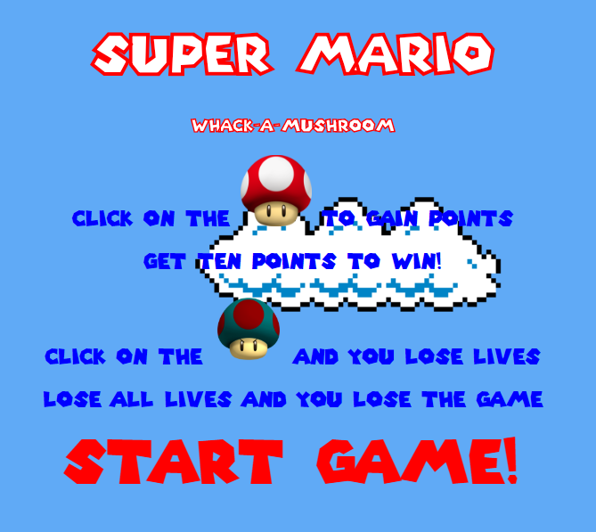
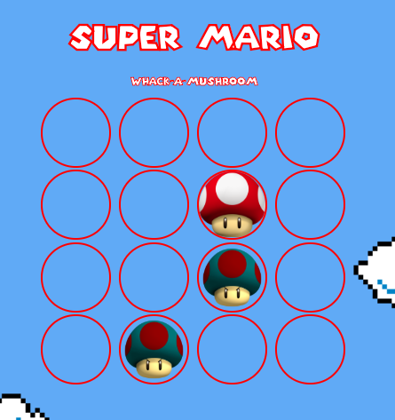

# Capstone

WDI project 4 capstone

## Motivation

I was presented with the problem to create a game as part of my final project.

## Code Used:

1.  HTML
2.  CSS
3.  Javascript
    ..\* JQuery

## Screenshots




## Code Example

```javascript
//when the user clicks on a a circle it checks wether or not you click on a mushroom or an angry mushroom
// and adds points or removes lives accordingly
$(".circle").on("click", event => {
  if ($(event.target).hasClass("mushroom") === true) {
    $(".mushroom")[0].play();
    score++;
    scoreKeeper(score);
    $(event.target).removeClass("mushroom");
    checkWinner();
  } else if ($(event.target).hasClass("angry-mushroom") === true) {
    $(".angry-mushroom")[0].play();
    lives--;
    scoreKeeper(score);
    $(event.target).removeClass("angry-mushroom");
    checkWinner();
  }
});
```

## Credits
All images/sounds/names do not belong to me and are used solely for educational purposes.
